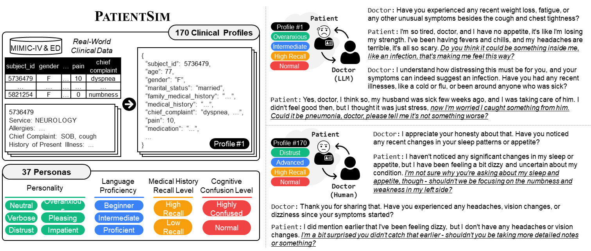

# PatientSim: A Persona-Driven Simulator for Realistic Doctor-Patient Interactions 
## Overview
Doctor-patient consultations require multi-turn, context-aware communication tailored to diverse patient personas. 
Training or evaluating doctor LLMs in such settings requires realistic patient interaction systems. However, existing simulators often fail to reflect the full range of personas seen in clinical practice. 
To address this, we introduce PatientSim, a patient simulator that generates realistic and diverse patient personas for clinical scenarios, grounded in medical expertise.
PatientSim operates using: 1) clinical profiles, including symptoms and medical history, derived from real-world data in the MIMIC-ED and MIMIC-IV datasets, and 2) personas defined by four axes, personality, language proficiency, medical history recall level, and cognitive confusion level, yielding 37 unique combinations.
We evaluated eight LLMs for factual accuracy and persona consistency. 
The top-performing open-source model, Llama 3.3, was validated by four clinicians to confirm the robustness of our framework.
As an open-source, customizable platform, PatientSim provides a reproducible and scalable solution that can be customized for specific training needs. 
Offering a privacy-compliant environment, it serves as a robust testbed for evaluating medical dialogue systems across diverse patient presentations and shows promise as an educational tool for healthcare.
 


<br />

## Environment
### Installation
For Linux systems, ensure Python 3.11 or higher is installed. Then, set up the environment and install dependencies:
```
# Set up the environment
conda create -n patientsim python=3.11

# Activate the environment
conda activate patientsim

# Install required packages
pip install -r requirements.txt
```
<br />

## Patient Profile Construction
### Prerequisites
We are currently utilizing three databases: MIMIC-IV (v3.1), MIMIC-IV-Note (v2.2), and MIMIC-IV-ED (v2.2). 
All these source datasets require a credentialed Physionet credentialing. To access the source datasets, you must fulfill all of the following requirements:
1. Be a [credentialed user](https://physionet.org/settings/credentialing/)
    - If you do not have a PhysioNet account, register for one [here](https://physionet.org/register/).
    - Follow these [instructions](https://physionet.org/credential-application/) for credentialing on PhysioNet.
    - Complete the "CITI Data or Specimens Only Research" [training course](https://physionet.org/about/citi-course/).
2. Sign the data use agreement (DUA) for each project
    - https://physionet.org/sign-dua/mimiciv/3.1/
    - https://physionet.org/sign-dua/mimic-iv-ed/2.2/
    - https://physionet.org/sign-dua/mimic-iv-note/2.2/


### Download
- Download the dataset using the provided link [<a href="https://kaggle.com/datasets/f04fc0f48b1b3677d31006555c5f8bae7766a7384c66ba210f6526bd58d85b79">link</a>].
- Unzip the dataset in the `./src/data/final_data` folder, which is the default path for the PatientSim experiment.


### Data Preprocessing
After obtaining access, preprocess the data using the following script (with your PhysioNet credentials):
```
cd src
bash build_dataset.sh
```

Update your API key before running:
```
export GOOGLE_APPLICATION_CREDENTIALS="YOUR_GOOGLE_APPLICATION_CREDENTIALS_PATH"
export GOOGLE_PROJECT_ID="YOUR_PROJECT_ID"
```
**Note**: While this script mirrors our internal preprocessing, results may vary due to API-based fluctuations. For consistent outcomes, we recommend using the preprocessed dataset available on Kaggle.

<br />

## Running the Simulation
### API Setup
Set API credentials for Google, Gemini, OpenAI, Azure, or other supported services. You can either:
**Option 1: Use environment variables**
```
export GOOGLE_APPLICATION_CREDENTIALS="YOUR_GOOGLE_APPLICATION_CREDENTIALS_PATH"
export GOOGLE_PROJECT_ID="YOUR_PROJECT_ID"
export GEMINI_API_KEY="YOUR_GEMINI_API_KEY"
export OPENAI_API_KEY="YOUR_OPENAI_API_KEY"
export AZURE_OPENAI_KEY="YOUR_AZURE_OPENAI_KEY"
export AZURE_ENDPOINT="YOUR_AZURE_ENDPOINT"
export VLLM_PORT="YOUR_VLLM_PORT"
```

**Option 2: Update in code (`src/models.py`)**
```
os.environ["GOOGLE_APPLICATION_CREDENTIALS"] = os.getenv("GOOGLE_APPLICATION_CREDENTIALS", "./google_credentials.json")
os.environ["GOOGLE_PROJECT_ID"] = os.getenv("GOOGLE_PROJECT_ID", "")
GOOGLE_PROJECT_ID = os.getenv("GOOGLE_PROJECT_ID", "")
GEMINI_API_KEY = os.getenv("GEMINI_API_KEY", "")
OPENAI_API_KEY = os.getenv("OPENAI_API_KEY", "")
AZURE_OPENAI_KEY = os.getenv("AZURE_OPENAI_KEY", "")
AZURE_ENDPOINT = os.getenv("AZURE_ENDPOINT", "")
PORT = os.getenv("VLLM_PORT", "")
```

### vLLM setting
Start the vLLM server:
```
python -m vllm.entrypoints.openai.api_server \
    --model meta-llama/Llama-3.3-70B-Instruct \
    --load-format safetensors \
    --max-model-len 9182 \
    --port PORT
```


### Default Settings
To run a simulation with default persona and hyperparameters:
```
cd src
python run_simulation.py \
    --exp_name "YOUR_EXP_NAME" \
    --doctor_api_type gpt_azure \
    --patient_api_type vllm \
    --doctor_llm "gpt-4o-mini" \
    --patient_llm "vllm-llama3.3-70b-instruct"
```
**Note**: Adjust LLM backbones as needed. Default hyperparameters are based on the paper's experiments.


### Custom Persona Settings (Optional)
To customize the patient persona, use the following:
```
cd src
python run_simulation_valid.py \
    --exp_name "YOUR_EXP_NAME" \
    --personality_type "$personality_type" \
    --cefr_type "$cefr_type" \
    --recall_level_type "$recall_type" \
    --dazed_level_type "$dazed_type" \
    --doctor_api_type gpt_azure \
    --patient_api_type vllm \
    --doctor_llm "gpt-4o-mini" \
    --patient_llm "vllm-llama3.3-70b-instruct"
```
**Note**: Adjust persona types and LLM backbones as needed. Default hyperparameters are based on the paper's experiments.

<br />

## Evaluation
### Dialog-Level Evaluation
Evaluate generated dialogues for persona fidelity, profile consistency, or differential diagnosis (DDx):
```
cd src
python ./eval/llm_eval.py \
    --trg_exp_name "${trg_exp_name}"  \
    --moderator gemini-2.5-flash-preview-04-17  \
    --moderator_api_type genai  \
    --eval_persona_quality  
```
**Flags**:
- `--eval_persona_quality`: Evaluate persona fidelity.
- `--eval_profile_consistency`: Evaluate profile consistency/coverage.
- `--eval_ddx`: Evaluate differential diagnosis.

### Sentence-level evaluation 
Evaluate generated dialogues at the sentence level:
```
cd src
python ./eval/llm_eval_NLI_batch.py \
    --trg_exp_name "${trg_exp_name}" \
    --moderator gemini-2.5-flash-preview-04-17 \
    --eval_target all \
    --moderator_api_type genai
```

### Analysis
To analyze the results in more detail, we provide a Jupyter Notebook (`analysis.ipynb`) in the same link as the dataset [<a href="https://kaggle.com/datasets/f04fc0f48b1b3677d31006555c5f8bae7766a7384c66ba210f6526bd58d85b79">link</a>].